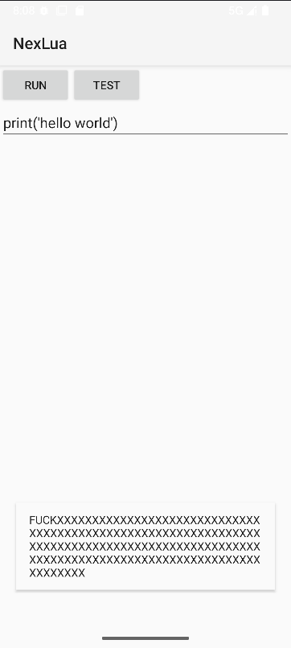

# What's this?

This is a simple library to bypass the icon and two-line text limitations added by Android 12 Toast.

## How to use?

1. Move the NexToast.java file to your project.
2. Change the package name if you like.
3. Use NexToast like you would use Toast.

## Example

```java
NexToast.makeText(this, "Hello World!", Toast.LENGTH_SHORT).show();
```



## License

What, License? It's just a simple library bro. [DO WHAT THE FUCK YOU WANT](LICENSE)
