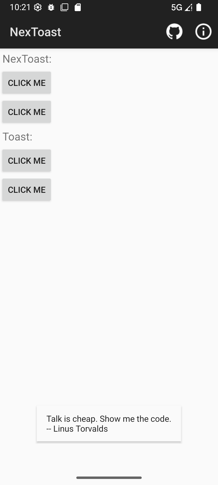
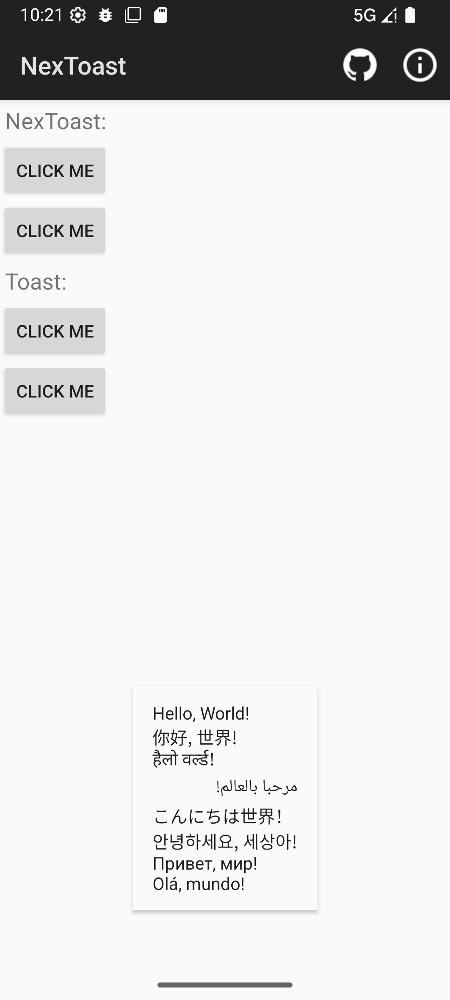
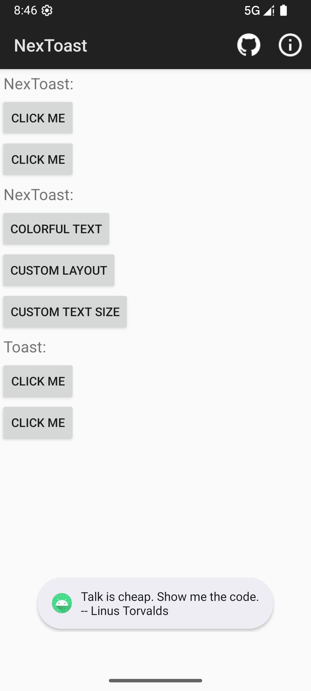

<div align="right">
  Language:
  <a title="Chinese" href="./README.md">English</a>
  简体中文
</div>

[](https://repo1.maven.org/maven2/io/github/justlikecheese/nextoast/NexToast/)
[](https://github.com/JustLikeCheese/NexToast/releases/latest)
[](https://github.com/JustLikeCheese/NexToast/blob/main/LICENSE)

# NexToast

NexToast 是一个简单的库用于移除于 Android 12 添加的图标和文本两行限制。

## 如何使用

### 通过 Gradle

```gradle
dependencies {
    implementation 'io.github.justlikecheese.nextoast:NexToast:1.2.1'
}
```

### 手动导入

1. 移动 [NexToast.java](nextoast/src/main/java/io/github/justlikecheese/nextoast/NexToast.java) 文件到你的项目。
2. 如果你需要，可以更改包名
3. 像 Toast 一样使用 NexToast

## 例子

像 Toast 一样使用 NexToast

```java
NexToast.makeText(this, "Hello World!", Toast.LENGTH_SHORT).show();
```

## 截图

<div style="overflow: hidden">





</div>

## 特色 API

NexToast 增加了一些有用的 API。

### TextView getTextView()

返回 NexToast 的 TextView 文本。

```java
NexToast toast = NexToast.makeText(this, "Hello World!", Toast.LENGTH_SHORT);
toast.getTextView().setTextColor(0xFF555555); // 更改 Toast 文本颜色
toast.show();
```

## 贡献

如果你有任何想法和问题，欢迎提 issue 或 pr。

## 许可证

什么？许可证，这只是一个简单的库而已。[你想干啥就干啥](LICENSE)。
